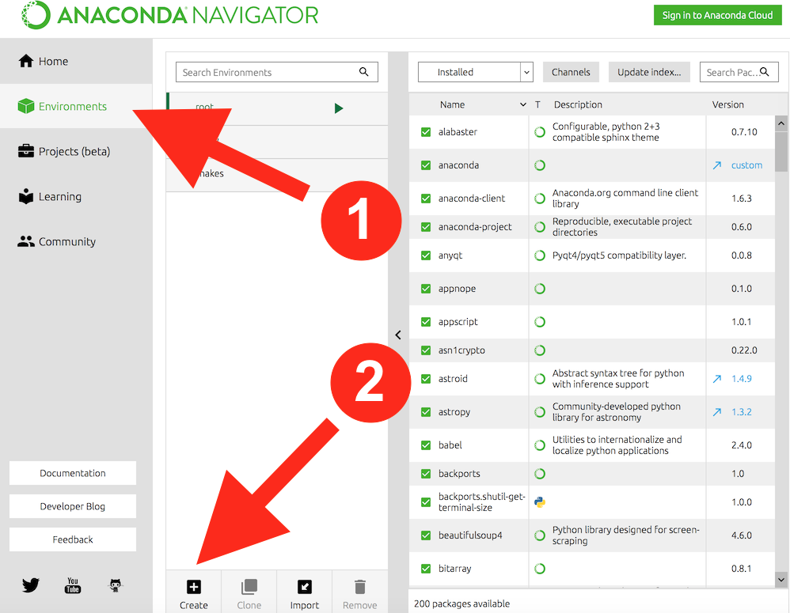

(tp:0-installation)=
# Préparer son ordinateur

Ce document détaille les étapes pour disposer sur votre machine personnelle de l'environnement Python utile en programmation scientifique et dans le Master.

## Pourquoi installer un environnement sur sa machine ...

... et ne pas simplement utiliser [Google Colab](https://colab.research.google.com/?hl=fr) ?

Il est commode d'utiliser _ponctuellement_ cette ressource. 
Alors pourquoi  "perdre du temps" à installer un environnement Python _qui fonctionne_ sur sa machine ? 
La question est légitime. 
Je partage entièrement les arguments pros/cons développés dans ce [bootcamp](http://justinbois.github.io/bootcamp/2020_fsri/lessons/l00_configuring_your_computer.html#Why-install-on-my-own-machine?) d'apprentissage de la programmation scientifique en Python.

## Pré-requis selon votre OS

### Mac OS

- installer XCode

### Windows

- installer `Firefox` ou `Chrome` car `Jupyter Lab` ne fonctionne pas avec `Internet Explorer`. 
    - **Rmq.** `Jupyter Lab` fonctionne avec le browser récent `Microsoft Edge` 
- [installer `git`](https://gitforwindows.org)

A partir de maintenant, aucune hypothèse est faite sur l'OS utilisé.
Ce document a été préparé dans un environnement Mac OS Catalina (10.15.7).
Selon votre système, quelques différences peuvent exister.

## Les étapes pour la première installation

Sauter cette section une fois l'installation effectuée

On va installer une distribution python : [anaconda](https://www.anaconda.com/) ou [miniconda](https://docs.conda.io/en/latest/miniconda.html) si votre espace disque est réduit.
Puis on va créer un environnement virtuel qui permet de séparer l'espace de _votre_ travail Python de [celui de la distribution](sec:root) ou de versions de Python déjà présentes sur votre machine. 
Ainsi vous serez propriétaire et gestionnaire de cet environnement (monPython) dans lequel vous installerez les modules dont vous avez besoin pour votre projet.
Il est classique de créer un environnement de travail spécifique à chaque projet que l'on développe.

1. installer la distribution python **3.9** d'[anaconda](https://www.anaconda.com/products/distribution)  
    - Il suffit de télécharger le fichier proposé (ça peut être un peu long) et l'installer simplement en cliquant
    - Si anaconda est déjà présent sur votre machine, s'assurer qu'il s'agit bien de la distribution python **3.9**. Dans le cas contraire, [désinstallez](https://docs.anaconda.com/anaconda/install/uninstall/) cette version d'anaconda 
    - L'installation prend du temps et nécessite une connection internet. Elle peut régulièrement vous demander d'installer une nouvelle version d'un des nombreux composants de la distribution.
2. créer un environnement virtuel (par exemple `monPython`) 
    - en ligne de commande (si besoin s'aider de cette [page](https://www.pythoniste.fr/anaconda/les-environnements-virtuels-en-python-avec-anaconda/) ou de [celle-ci](https://fr.acervolima.com/configurer-un-environnement-virtuel-pour-python-a-laide-danaconda/)) :
    ```shell
    conda create -n monPython python=3.9
    ```  
    - ou en utilisant l'interface graphique du navigateur anaconda :
    
3. installer [les modules utiles](sec:modules) dans `(monPython)`
    - un à un avec la commande `conda install ...`
    - ou en utilisant l'interface graphique du navigateur anaconda.
    
Ca y est : vous pouvez enfin commencer à travailler dans un cadre que vous maîtrisez entièrement.

(sec:root)=
### Note concernant anaconda sur Windows

L'installation d'anaconda sous windows s'effectue en mode `root`. 
Si vous n'êtes pas (`root`) sur votre machine, le lancement de certaines applications peut vous être refusé.
En revanche, vous êtes propriétaire de tout environnement que vous créez.


(sec:modules)=
## Liste des modules utiles

- `numpy`
- `matplotlib`
- `jupyterlab`
- `jupyterlab-spellchecker`
- `jupyterlab-language-pack-fr-fr`
- `jupyterlab-mathjax3`

## Utiliser votre environnement

1. Commencer chaque session de travail en activant votre environnement virtuel :

```bash
conda activate monPython
```

Votre prompt shell doit maintenant commencer par le nom de l'environnement entre parenthèses, ici '(monPython)' :

```bash
(monPython) bash-3.2$ 
```

2. Lancer Jupyter Lab :  
- en ligne de commande (dans un terminal), avec la commande `jupyter lab` ou `jupyter-lab` 
```bash
(monPython) bash-3.2$ jupyter lab
```
- via l'interface graphique du navigateur anaconda :


3. Jupyter Lab s'ouvre dans votre browser web. Son interface est similaire à celle-ci.


- Un nouveau notebook peut être créé et lancé par l'icône de la section `Notebook`  (celui qui indique `ipython`) ou bien sûr via le menu Fichier/Nouveau.
- L'accès et le lancement de notebooks existants s'obtient après avoir cliqué sur l'icône Dossier de la barre latérale (menu vertical à gauche) qui vous permet de vous déplacer dans votre arborescence de travail.

4. Pour terminer _proprement_ votre session 

Une exécution d'un noyau python différent est associé à chaque notebook ouvert.  

- Il est conseillé d'arrêter tout ces noyaux en cours d'exécution via l'icône de la barre latérale :    
- Remarquez que les onglets des notebooks restent ouverts. 
    - Si besoin, vous relancez le noyau du notebook via l'icône  

## Autres références 

- [Un tutoriel en français](https://zestedesavoir.com/tutoriels/1448/installer-un-environnement-de-developpement-python-avec-conda/) .
- [Un autre en anglais](https://www.dataquest.io/blog/installing-python-on-mac/) et très complet.

Le web est bien sûr plein de tutos et autres sites explicatifs ...

## Pour finir

Bon travail : la programmation s'apprend en pratiquant !


